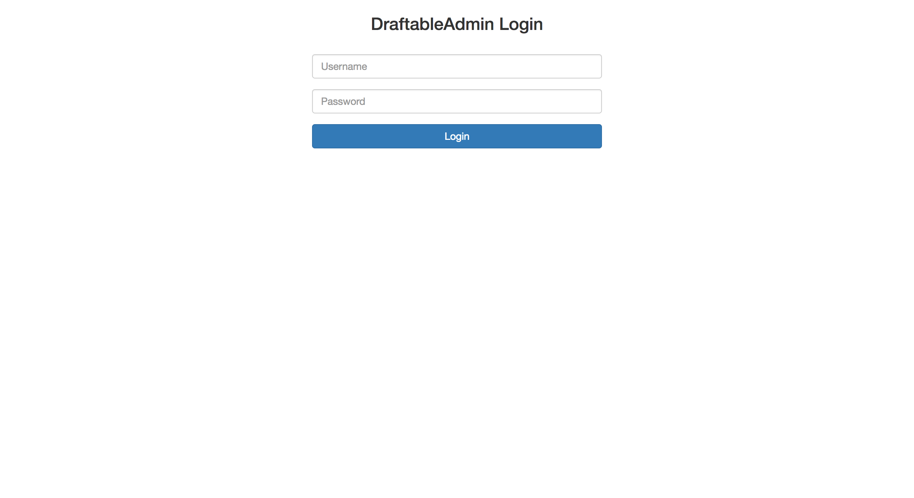
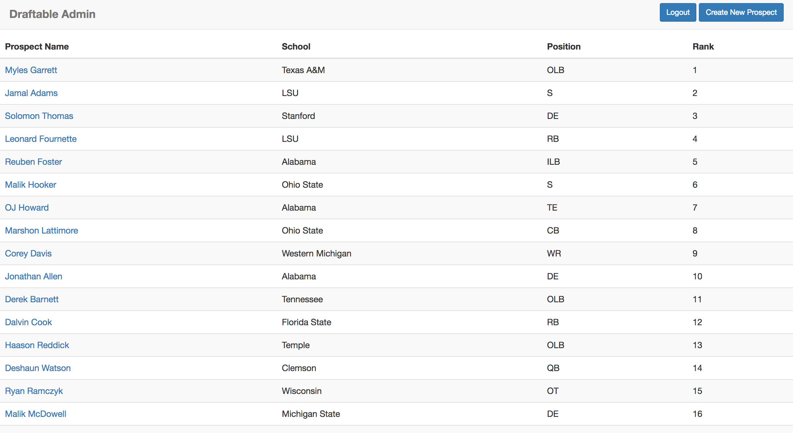
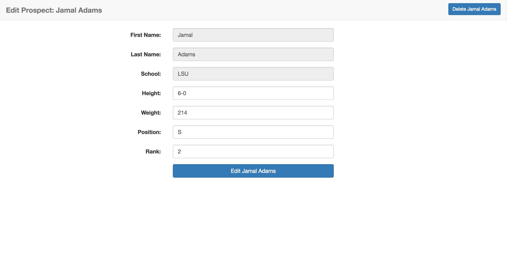
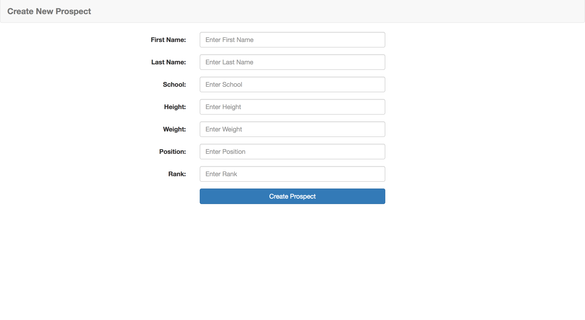

# DraftableAdmin

Developed using Angular2 this app was designed as an admin app using the DraftableApi; https://github.com/mboor/DraftableApi

*Note this was created in my free time for fun to increase my working knowledge of Angular2.*

* Draftable Admin Functionality
  * Cookie Authorization
  * Restricted access to webpages using Angular2 Route Guards
  * View all prospects sorted by their overall rank
  * Create Prospect
  * Edit/Update Prospect
  * Delete Prospect

### Images
#### Login Page
  
#### All Prospects Page
  
#### Edit Prospect Page
  
#### Create Prospect Page
  
